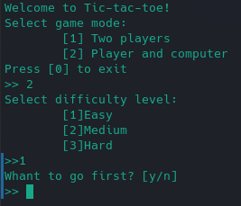
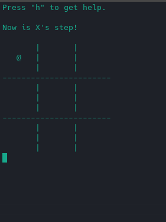
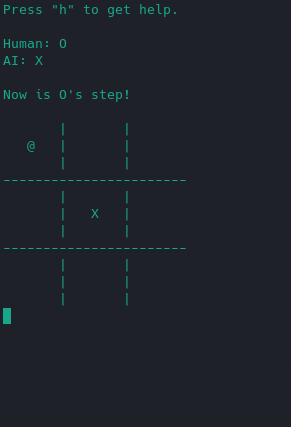

# AI Tic-Tac-Toe #

Эта консольная игра "крестики-нолики" со встроенным искусственным интеллектом была разработана с помощью ```C++```.

Присутсвует два режима игры:

+ ```two players```
+ ```player and computer```

## Player and computer ##

Искусственный интеллект основан на алгоритме Минимакс. Присутсвует выбор уровня сложности игры (`easy`, `medium` или `hard`), который регулируется с помощью ограничения глубины обхода дерева решений. 

## Управление ##

+ `WASD` - перемещение по полю;
+ `e` - поставить X/O;
+ `r` - начать игру заново;
+ `h` - помощь;
+ `q` - выход из игры.

## Аргументы при запуске ##

```
./tictactoe
```


## Примеры ##
### Стартовое меню ###


### Two players ###



### Player and computer ###

